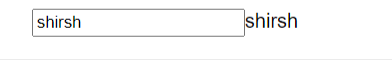

## `Available Scripts`

In the project directory, you can run:

### `yarn start`

Runs the app in the development mode.\
Open [http://localhost:3000](http://localhost:3000) to view it in the browser.

The page will reload if you make edits.\
You will also see any lint errors in the console.


[Youtube video link](https://www.youtube.com/watch?v=LlvBzyy-558&t=1273s)
# All hooks

## `1)UseState Hook`

```js
import React, { useState } from "react";
const StateTutorial = () => {
  const [inputValue, setInputValue] = useState("Shirshak");
  //if we use let inputValue in js and change in onChange. It will be change but in dom it will not render.
  let onChange = (event) => {
    const newValue = event.target.value;
    setInputValue(newValue);
  };
  return (
    <div>
      <input placeholder="enter something..." onChange={onChange} />
      {inputValue}
    </div>
  );
};
export default StateTutorial;
```

## `2)UseReducer Hook`
**Single place to change multiple state alternative of useState**


```jsx
import React, { useReducer } from 'react'
const reducer = (state, action) => {
  switch (action.type) {
    case 'INCREMENT':
      return { count: state.count + 1, showText: state.showText }
    case 'toggleShowText':
      return { count: state.count, showText: !state.showText }
    default:
      return state
  }
}
const ReducerTutorial = () => {
  const [state, dispatch] = useReducer(reducer, { count: 0, showText: true })

  return (
    <div>
      <h1>{state.count}</h1>
      <button
        onClick={() => {
          dispatch({ type: 'INCREMENT' })
          dispatch({ type: 'toggleShowText' })
          /* If we use useState here 
           setCount(count+1);
           setShowText(!showText)  */
        }}
      >
        Click Here
      </button>

      {state.showText && <p>This is a text</p>}
    </div>
  )
}
export default ReducerTutorial
```

## 3)UseRef Hook


```jsx
import React, { useRef } from 'react'
function RefTutorial() {
  const inputRef = useRef(null)

  const onClick = () => {
//when click on Change name button it will black input and focus it
    inputRef.current.value = ''
    inputRef.current.focus()
  }
  return (
    <div>
      <h1>Pedro</h1>
      <input type="text" placeholder="Ex..." ref={inputRef} />
      <button onClick={onClick}>Change Name</button>
    </div>
  )
}
export default RefTutorial

```

## 4)UseLayoutEffect hook

```js
import { useLayoutEffect, useEffect, useRef } from 'react'

function LayoutEffectTutorial() {
  const inputRef = useRef(null)
  //useLayoutEffect will run before the useEffect
  useLayoutEffect(() => {
    alert(inputRef.current.value) //will print shirshak
  }, [])

  useEffect(() => {
    inputRef.current.value = 'HELLO'
  }, [])

  return (
    <div className="App">
      <input ref={inputRef} value="Shirshak" style={{ width: 400, height: 60 }} />
    </div>
  )
}
export default LayoutEffectTutorial
```

## 5)UseImperativeHandle

## 6)UseContext hook

```jsx
//src\UseContext\ContextTutorial.js
import React, { useState, createContext } from 'react'
import Login from './Login'
import User from './User'

export const AppContext = createContext(null)

function ContextTutorial() {
  const [username, setUsername] = useState('')

  return (
    <AppContext.Provider value={{ username, setUsername }}>
      <Login /> <User />
    </AppContext.Provider>
  )
}
export default ContextTutorial

//src\UseContext\Login.js
import React, { useState, createContext } from 'react'
import Login from './Login'
import User from './User'

export const AppContext = createContext(null)

function ContextTutorial() {
  const [username, setUsername] = useState('')

  return (
    <AppContext.Provider value={{ username, setUsername }}>
      <Login /> <User />
    </AppContext.Provider>
  )
}

export default ContextTutorial
```


